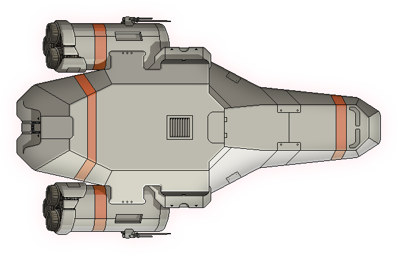

# Dotfiles
> My dotfiles... What do you want? 

My personal dotfiles repo. Documentation is pretty spotty. Maybe I'll fix that 
someday, but I probably won't. 

|  | Primary desktop. |
|---|---|
|  | Home server. |
|  | Steam Deck. |

## Usage

Dotfiles are managed with chezmoi and located in the `home` folder. Ansible 
scripts for installing and configuring various linux distrobutions are located 
in the `provision` folder
