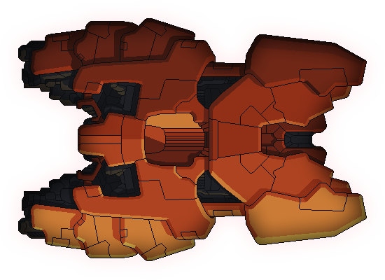
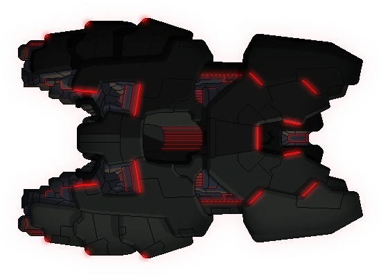
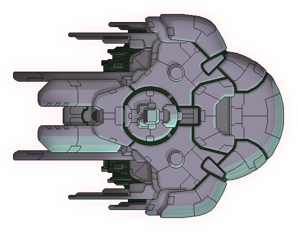

# Dotfiles
> My dotfiles... What do you want? 

My personal dotfiles repo. Documentation is pretty spotty. Maybe I'll fix that 
someday, but I probably won't. 

## Usage

Dotfiles are managed with chezmoi and located in the `home` folder. The NixOS 
flake contained in `provision` contains nix code for installing and configuring 
my various NixOS based machines. See the provision [readme](./provision/readme.md)
for information on initial installation.

## Managed Machines

| | Name | Role | Description |
|---|---|---|---|
|  | [Kestrel](./provision/hosts/kestrel/) | Primary desktop | Main machine that does it all gaming, programming, 3D modelling, etc. |
|  | [Torus](./provision/hosts/torus/) | Home server | Primary home server for storage, hosting machine backups, and running services like Jellyfin. |
|  | [Bulwark](./provision/hosts/bulwark/) | Steam Deck | NixOS based Steam Deck that can has my linux niceties and acts like a Steam Deck using the great [Jovian Nixos](https://github.com/Jovian-Experiments/Jovian-NixOS). |
|  | [Shivan](./provision/hosts/shivan/) | Personal Laptop | Personal (and very slow) laptop for basic mobile work. |
|  | [Man of War](./provision/hosts/manofwar/) | 3D Printer RPI | Host for klipper and other services on Voron 2.4 Rev C. |
